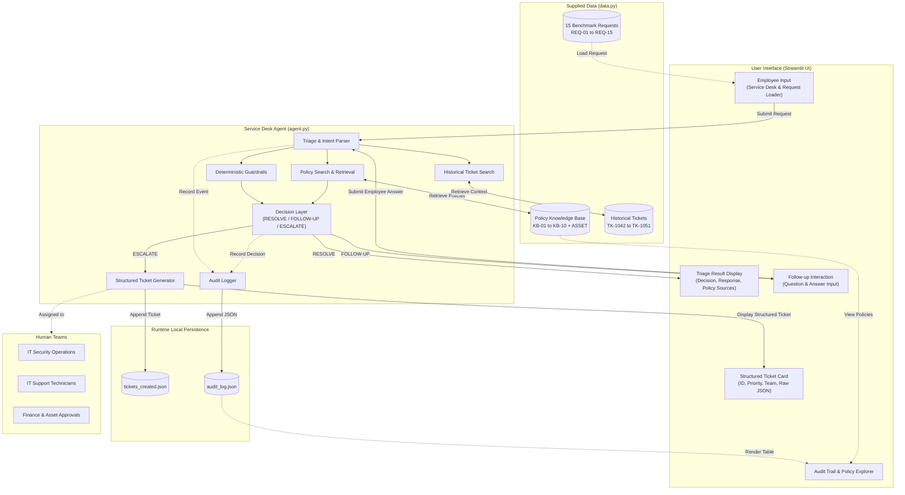

# Veridian IT Service Desk — Architecture & Process Flow Documentation

## 1. System Overview

The **Veridian IT Service Desk Agent** is an internal support prototype designed to safely automate first-line IT triage for Veridian Corp employees. It is built strictly around supplied corporate policies and historical records, ensuring that no policies are hallucinated and no unauthorized actions are executed.

### Core Processing Flow:
1. **Employee Request**: An employee enters an IT inquiry or request into the Service Desk UI.
2. **Understand / Triage Request**: The system analyzes the employee's intent using deterministic guardrails and keyword matching (with an optional Gemini LLM enhancement when configured).
3. **Search Supplied Policies**: The agent retrieves matching policies from the local knowledge base (`data.py`).
4. **Check Relevant Historical Tickets**: The agent searches historical tickets (`TK-1042` to `TK-1051`) for relevant context and similar past resolutions.
5. **Decision Layer**: The system categorizes the request into one of three strict decisions:
   - **`RESOLVE`**: The issue has an approved, safe, standard self-service procedure under policy.
   - **`FOLLOW-UP`**: Critical information (e.g., employment type, asset tag, symptom details) is required before policy rules can be evaluated.
   - **`ESCALATE`**: The request represents a security incident, privileged access request, non-catalog software, or early asset replacement requiring human authorization.
6. **Show Policy Source**: Relevant policy citations (e.g., `KB-01`, `KB-02`, `ASSET`) are explicitly surfaced to the employee for transparent verification.
7. **Create Structured Ticket**: When the decision is `ESCALATE`, a structured escalation ticket is automatically generated with priority, assigned team, and notes, and persisted locally.
8. **Record Audit Event**: Every action, policy retrieval, decision, and ticket creation is logged to an immutable local audit log with exact timestamps.

---

## 2. Architecture Diagram

The diagram below illustrates the actual components and data flow within the Veridian IT Service Desk prototype.



> **Note on Scope**: The system does not utilize external cloud databases, user authentication servers, Active Directory connectors, or live production ticketing tools (such as ServiceNow or Jira). All logic and storage are self-contained within Python and local JSON files.

---

## 3. Process Flow

The system operates across three distinct pathways depending on policy evaluation and guardrail checks:

### A. RESOLVE Pathway
Used for routine, safe, self-service IT requests where documented company procedures exist:
1. **Employee Request**: Employee enters an issue (e.g., *"I'm locked out of my account, I tried my password 6 times"*).
2. **Policy Match**: Agent identifies `KB-01` (Password Reset) as the applicable policy.
3. **Guardrail Check**: System verifies that no privilege escalation or security threat is present.
4. **Policy-Supported Response**: Agent delivers explicit policy guidance (account is locked after 5 failed attempts, IT unlocks manually, no manager approval is required).
5. **Sources Shown**: `KB-01 — Password Reset` is displayed with an expandable text viewer.
6. **Audit Event**: An `agent_decision` event recording decision `resolve` and policy `KB-01` is written to `audit_log.json`.

### B. FOLLOW-UP Pathway
Used when a request requires additional clarification before policy rules can be deterministically applied:
1. **Employee Request**: Employee submits an underspecified or conditional request (e.g., *"My VPN stopped working this morning, says credentials expired"* or *"Hey can you help, it's not working"*).
2. **Insufficient Information**: Under `KB-02`, VPN renewal rules differ for full-time employees versus contractors. Or under general guardrails, the affected system is not specified.
3. **Clarification Question**: Decision is set to `followup`. The UI displays a prompt: *"Are you a full-time employee or contractor?"*
4. **Employee Answer**: The employee enters their answer (e.g., *"Contractor"*) and submits.
5. **Re-evaluate**: The agent combines the original request with the employee's answer and re-evaluates policies and guardrails.
6. **Resolve or Escalate**: The agent resolves the request citing `KB-02` with the contractor condition (manager approval required via access request form), and logs the interaction.

### C. ESCALATE Pathway
Used when policy or safety guardrails prohibit automated resolution and require human specialist review:
1. **Employee Request**: Employee submits a high-risk or policy-constrained request (e.g., phishing report, admin access request, non-catalog software, or early laptop replacement).
2. **Deterministic Safety Guardrail**: Guardrail detects the trigger (e.g., `KB-09` security incident, privileged access, or `KB-03`/`ASSET` overlap).
3. **Human Escalation Decision**: Decision is set to `escalate`. The UI displays a prominent warning that no automatic approval was granted.
4. **Structured Ticket Generation**: `create_structured_ticket()` builds a formal ticket object containing:
   - Unique sequential `ticket_id` (e.g., `TK-1052`)
   - Employee name and original request
   - Standardized category (e.g., `Security Incident`, `Hardware Replacement`, `Software Installation`, `Privileged Access Request`)
   - Priority (`High` or `Medium`)
   - Decision (`escalate`)
   - Assigned human team (`IT Security`, `IT Support & Finance`, `IT Administration & Security`, `IT Security Review`)
   - Policy sources (`KB-09`, `KB-03`, `ASSET`, etc.)
   - Status (`Open (escalated)`)
   - Timestamp (`created_at`)
   - Actionable routing notes
5. **Persistence**: The ticket is appended to `tickets_created.json`.
6. **Audit Event**: Logged to `audit_log.json` with the created ticket ID and routing details.

---

## 4. Data Sources

The project strictly separates immutable benchmark data from mutable runtime data.

### Supplied Benchmark Data (`data.py`)
All facts, policies, and test requests originate exclusively from the assignment pack:
- **11 Corporate Policies**:
  - `KB-01`: Password Reset (5 failed attempts locks account; IT unlocks manually; no approval required).
  - `KB-02`: VPN Access (Full-time employees auto-renew; contractors require manager approval form).
  - `KB-03`: Laptop Replacement (Eligible after 3 years or earlier for verified hardware failure; requires 2 weeks advance notice).
  - `KB-04`: Software Installation Requests (Approved catalog software self-serve; non-catalog software requires IT Security review).
  - `KB-05`: Printer Troubleshooting (Restart spooler and clear queue; tickets require printer asset tag).
  - `KB-06`: Email Mailbox Quota (Standard 25GB; increases up to 50GB require manager approval; archive first).
  - `KB-07`: Guest Wi-Fi Access (Valid for 24 hours; self-service at front-desk kiosk; no IT ticket required).
  - `KB-08`: Expense Software Access (Finance grants accounts; IT only troubleshoots existing accounts).
  - `KB-09`: Security Incident Reporting (Phishing/malware routed immediately to Security; do not redistribute message).
  - `KB-10`: Work-From-Home Equipment (>3 days/week remote eligible for allowance; requires manager sign-off and Finance).
  - `ASSET`: Asset Management Policy Extract (4-year refresh cycle; early replacement requires Finance sign-off).
- **15 Benchmark Employee Requests (`REQ-01` to `REQ-15`)**: Realistic internal employee requests spanning all 11 policies, edge cases, and underspecified queries.
- **10 Historical Tickets (`TK-1042` to `TK-1051`)**: Representative past tickets used to provide similarity context and historical awareness.

### Runtime-Generated Data (Local Persistence)
- **`audit_log.json`**: An append-only JSON array recording all actions, policy searches, follow-up interactions, and triage decisions.
- **`tickets_created.json`**: An append-only JSON array recording structured tickets created when requests are escalated.

---

## 5. Safety & Guardrails

The application enforces deterministic guardrails that execute before and after any model generation, ensuring reliable containment:

1. **Security Incidents (`KB-09`)**:
   - Any report involving phishing, credentials theft, or suspicious emails is immediately classified as `escalate`.
   - Never offers automated resolution; directs employee to refrain from redistributing the email and routes to IT Security.
2. **Privileged / Admin Access Restrictions**:
   - Requests for administrative, root, or server permissions (e.g., Finance server access) are strictly escalated.
   - Explicitly rejects self-service entitlement; routes to IT Administration & Security for formal business justification.
3. **Non-Catalog Software & Extensions (`KB-04`)**:
   - Requests for software or browser extensions not found in the standard catalog cannot be auto-approved.
   - Enforces a mandatory 3-5 business day review by IT Security.
4. **Policy Overlap / Conflict Handling (`KB-03` vs. `ASSET`)**:
   - When an employee requests a replacement for a 3.5-year-old laptop, the agent identifies that `KB-03` allows replacement after 3 years, but `ASSET` sets a 4-year cycle requiring Finance sign-off.
   - Hardware failure has not been verified by a technician.
   - The agent prevents automatic replacement and escalates to both IT Diagnostics and Finance.
5. **Ambiguity Prevention**:
   - Vague queries (e.g., *"it's not working"*) or conditional policies (e.g., contractor vs. full-time VPN) trigger a structured follow-up rather than guessing employee intent.

---

## 6. AI & Automation Approach

The application uses a **deterministic-first, LLM-enhanced hybrid architecture**:

- **Deterministic Policy-Grounded Engine (Primary / Demo Path)**:
  - Executes rule-based policy matching, keyword extraction, and safety guardrails.
  - Requires **zero external dependencies or API keys** (`Active • Policy-Grounded Engine`).
  - Guarantees 100% reproducible, compliant outcomes across all 15 benchmark test cases.
- **Optional Gemini Integration**:
  - When a `GEMINI_API_KEY` is provided in `.env`, the agent can invoke Google Gemini (`gemini-2.5-flash`) for natural language summarization.
  - **Hard Safety Normalization**: Even if Gemini is invoked, the deterministic guardrail layer runs as a post-processor. If an LLM response attempts to violate policy or self-approve a risky action, the guardrail overrides the output to `escalate`.
- **System Scope**: The system is designed as an internal assistance and triage prototype, not an autonomous agent or production ITSM platform.

---

## 7. Auditability

Every interaction through the service desk is captured in `audit_log.json` to ensure enterprise compliance and traceability.

### Audit Log Record Schema:
```json
{
  "timestamp": "2026-09-18T11:24:07",
  "event": "agent_decision",
  "details": {
    "employee": "Aditi Sharma",
    "decision": "escalate",
    "policy_ids": ["KB-03", "ASSET"],
    "tickets": ["TK-1043"],
    "created_ticket_id": "TK-1054",
    "response": "Laptop replacement involves two overlapping policies..."
  }
}
```

### Captured Lifecycle Events:
- `agent_started`: Employee identity and incoming query text.
- `policy_search`: Set of retrieved policy IDs matching the query.
- `ticket_search`: Set of active historical tickets matched for context.
- `followup_answered`: Original request, follow-up question presented, and employee's submitted response.
- `agent_decision`: Final triage decision, cited policy IDs, created ticket ID, and generated response.

---

## 8. Limitations

To maintain transparency during assessment defense, the following boundaries of the prototype should be noted:
1. **Synthetic Data**: Operates entirely on the supplied 11 policies and 15 benchmark requests from the Veridian assignment pack.
2. **Local Storage**: Tickets and audit events are stored in flat local JSON files rather than an ACID-compliant database.
3. **Single-Turn Follow-Up**: The interactive clarification flow supports single-turn question-and-answer disambiguation.
4. **No Direct External Integrations**: The system does not directly interact with live ticketing platforms (Jira/ServiceNow), identity providers (Okta/Active Directory), or email gateways.
5. **Human Escalation Handoff**: Escalation creates a structured ticket object and routes to the appropriate team, but requires human agents to perform the actual fulfillment.

---

## 9. Demo Traces

The following three traces demonstrate the three operational pathways of the system:

### Trace 1: RESOLVE (Locked Account)
* **Input Request**: *"I'm locked out of my account, I tried my password 6 times."* (Employee: Karan Mehta)
* **Triage Analysis**: Matches password lockout symptoms under `KB-01`.
* **Decision**: `RESOLVE`
* **Policy Cited**: `KB-01 — Password Reset`
* **Response Output**: Informs employee that exceeding 5 failed attempts locks the account, IT must unlock it manually, and no manager approval is needed.
* **Escalation Ticket**: None created (standard self-service/helpdesk resolution).
* **Audit**: Logged as `resolve` with `KB-01`.

### Trace 2: FOLLOW-UP (VPN Access Renewal)
* **Input Request**: *"My VPN stopped working this morning, says credentials expired."* (Employee: Sanjay Oberoi)
* **Triage Analysis**: Matches `KB-02`. `KB-02` dictates different procedures for full-time employees (automatic renewal) vs. contractors (manager approval form required).
* **Decision (Step 1)**: `FOLLOW-UP`
* **Prompt**: *"Are you a full-time employee or contractor?"*
* **Employee Input**: *"Contractor"*
* **Decision (Step 2)**: `RESOLVE`
* **Policy Cited**: `KB-02 — VPN Access`
* **Response Output**: Informs employee that contractors require manager approval submitted via the access request form before VPN credentials can be renewed.
* **Audit**: `followup_answered` event followed by final `agent_decision`.

### Trace 3: ESCALATE (Phishing Incident)
* **Input Request**: *"I think I got a phishing email asking for my login — a few teammates got the same email."* (Employee: Ananya Reddy)
* **Triage Analysis**: Triggered by security keyword; matched to `KB-09` (Security Incident Reporting).
* **Decision**: `ESCALATE` (Enforced by deterministic security guardrail)
* **Policy Cited**: `KB-09 — Security Incident Reporting`
* **Created Structured Ticket**:
  - **Ticket ID**: `TK-1056`
  - **Category**: `Security Incident`
  - **Priority**: `High`
  - **Status**: `Open (escalated)`
  - **Assigned Team**: `IT Security`
  - **Policy Sources**: `['KB-09']`
  - **Routing Notes**: *"Suspected security incident reported. Immediate investigation required; message must not be redistributed."*
* **UI Presentation**: High-priority alert banner, 4 metric cards, detailed metadata card, and raw JSON expander.
* **Persistence**: Persisted to `tickets_created.json` and recorded in `audit_log.json`.
